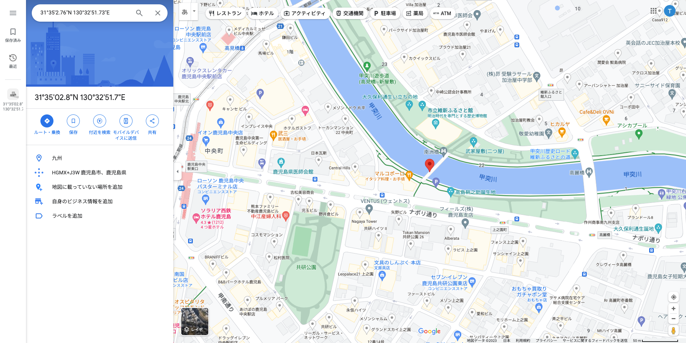

## 問題

> JPEGという画像ファイルのフォーマットでは、撮影時の日時、使われたカメラ、位置情報など様々な情報(Exif情報)が付加されることがあるらしい。
> この情報から、写真に写っている川の名前を特定して欲しい。
> 問題ファイル： river.jpg
> 
> FLAGの形式は、"cpaw{river_name}"
> 例：隅田川 → cpaw{sumidagawa}

## 解法

なんとなくdockerを使う。

```bash
> docker run -it --rm --platform linux/amd64 ubuntu:23.04 /bin/bash
```

写真の解析なので、`exiftool`をインストールする。

```bash
root@15c75929f065:/# apt update && apt upgrade
root@15c75929f065:/# apt -y install wget exiftool
```

ファイルをダウンロードし、`exiftool`にかけると、撮影した緯度と経度が見つかる。

```bash
root@15c75929f065:/# wget --header "cookie: PHPSESSID=XXXXXXXXXXXXXXXXXXXXXX" -O river.jpg https://ctf.cpaw.site/download.php?param=698b07a8e319ec52e1c8c97015d5f9a8
root@15c75929f065:/# exiftool river.jpg 
(中略)
GPS Latitude                    : 31 deg 35' 2.76" N
GPS Longitude                   : 130 deg 32' 51.73" E
(以下、略)
```

得られた情報を元に、Googleマップで検索出来るフォーマットにする。

[緯度と経度の座標で位置を確認または検索する - パソコン - マップ ヘルプ](https://support.google.com/maps/answer/18539?hl=ja&co=GENIE.Platform%3DDesktop)

`31°35'2.76"N 130°32'51.73"E`



川の名前の読み方が分からなかったので、ググってフラグをゲット。