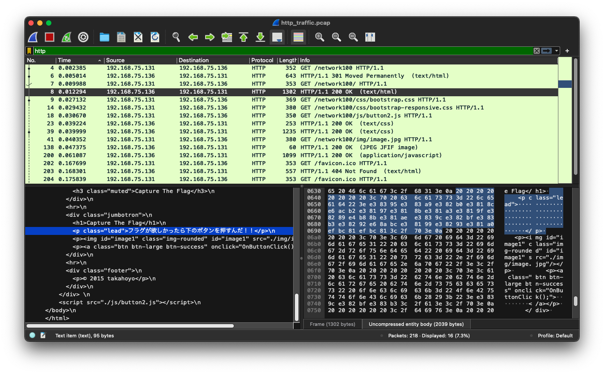
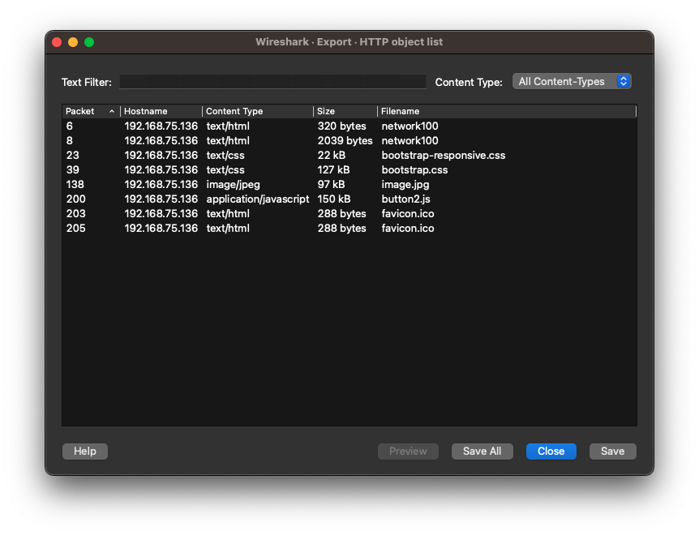
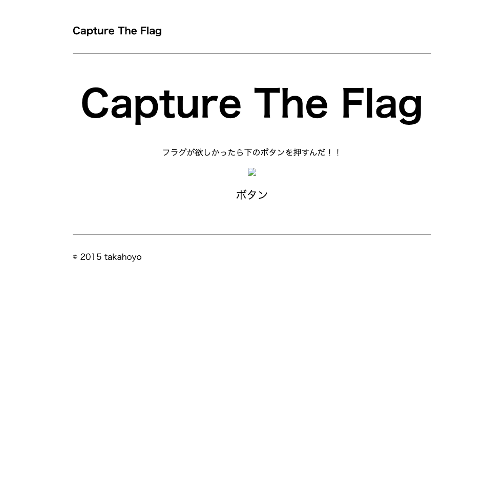
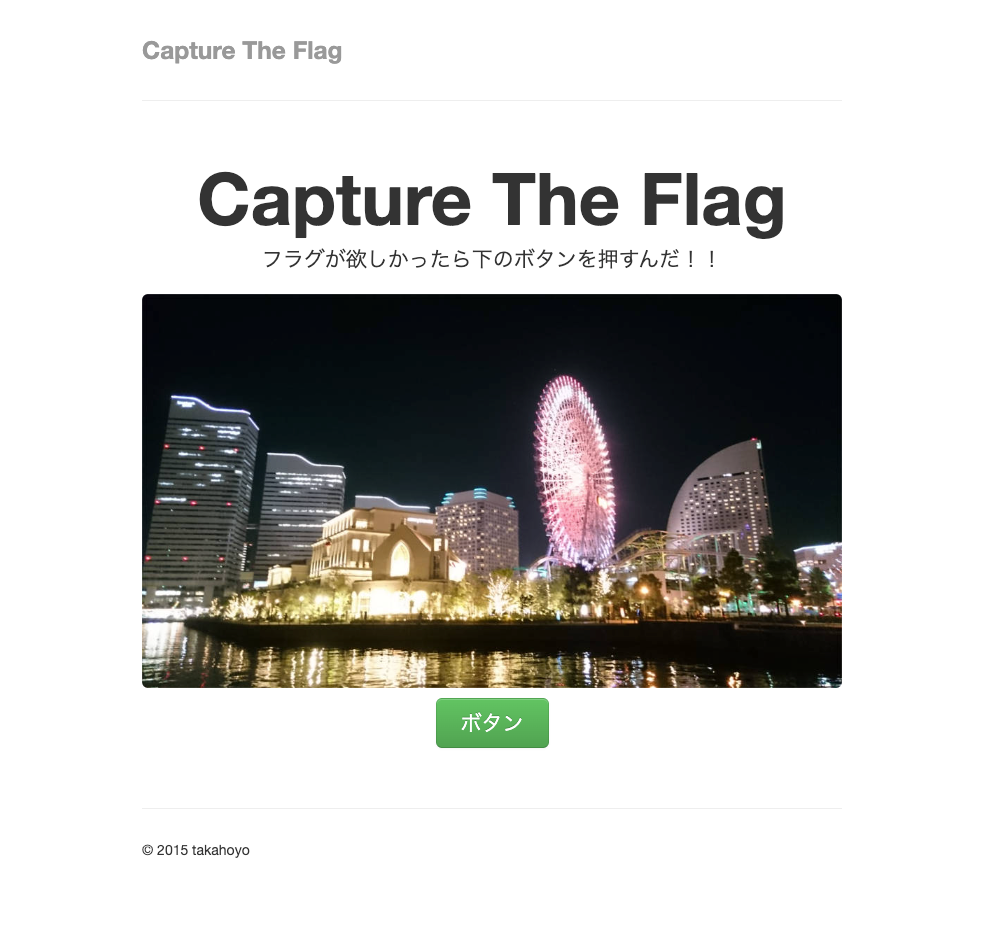

## 問題

> HTTPはWebページを閲覧する時に使われるネットワークプロトコルである。
> ここに、とあるWebページを見た時のパケットキャプチャファイルがある。
> このファイルから、見ていたページを復元して欲しい。
> http_traffic.pcap

## 解法

pcapファイルなので、wiresharkで開いてみる。



HTTPで通信して、なにやら怪しいHTMLが見えてくる。

File -> Export Objects -> HTTPを選択し、Save Allでローカルに全て保存する。



`network(1)`というファイルが、htmlファイルなのでファイル名を`network100.html`に変更し、ブラウザで開いてみる。



> フラグが欲しかったら下のボタンを押すんだ！！

とあるが、ボタンと書かれた文字を押しても反応がない。
ソースを見てみると、

```html
<a class="btn btn-large btn-success" onclick="OnButtonClick();">ボタン</a>
```

となっていて、本来ならボタンを押した時に、JavaScriptが発火するはずだが、`button2.js`というJavaScriptが読み込まれていないため、動作しないようだ。

`button2.js`というファイルを、下記のように`js`ディレクトリに下に移動させ、合わせて`css`と`img`ディレクトリも作り、それぞれファイルを移動させる。

```html
<script src="./js/button2.js"></script>
```

そして、リロードすると、CSS, 画像ファイル、 JavaScriptが適用される。



あとは、再度ボタンをクリックすれば、フラッグをゲットできる。