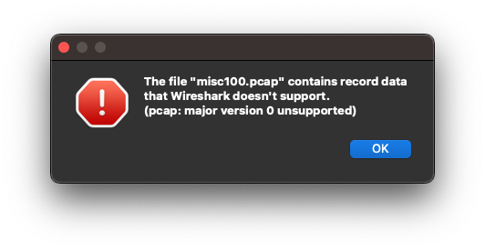

## 問題

> このファイルの中にはフラグがあります。探してください。
> フラグはすべて小文字です！
> 
> file

## 解法

ファイルをダウンロードして、`file`コマンドで調べてみる。

```bash
$ file misc100 
misc100: pcap capture file, microsecond ts (little-endian) - version 0.0 (linktype#1768711542, capture length 1869357413)
```

pcapとのことなので、ファイル名を`misc100.pcap`に変更してwiresharkで開いてみるが、開けない。



`cat`で読んで見ると、大量の`lovelive!`文字列と、その中に怪しい文字が埋め込まれている。

```bash
$ cat misc100 
?ò???e!lovelive!lovelive!lovelive!lovelive!lovelive!lovelive!lovelive!lovelive!lovelive!lovelive!lovelive!lovelive!lovelive!lovelive!lovelive!lovelive!lovelive!lovelive!lovelive!lovelive!lovelive!lovelive!lovelive!lovelive!lovelive!lovelive!lovelive!lovelive!lovelive!lovelive!lovelive!lovelive!lovelive!lovelive!lovelive!lovelive!lovelive!lovelive!lovelive!lovelive!lovelive!lovelive!lovelive!lovelive!lovelive!lovelive!lovelive!lovelive!lovelive!lovelive!lovelive!lovelive!lovelive!lovelive!lovelive!lovelive!lovelive!lovelive!lovelive!lovelive!lovelive!lovelive!lovelive!lovelive!lovelive!lovelive!lovelive!lovelive!lovelive!lovelive!lovelive!lovelive!lovelive!lovelive!lovelive!lovelive!lovelive!lovelive!lovelive!lovelive!lovelive!lovelive!lovelive!lovelive!lovelive!lovelive!lovelive!lovelive!lovelive!lovelive!lovelive!lovelive!lovelive!lovelive!lovelive!lovelive!lovelive!lovelive!lovelive!lovelive!lovelive!lovelive!lovelive!lovelive!lovelive!lovelive!lovelive!lovelive!lovelive!lovelive!lovelive!lovelive!lovelive!lovelive!lovelive!lovelive!lovelive!lovelive!lovelive!lovelive!lovelive!lovelive!lovelive!lovelive!lovelive!lovelive!lovelive!lovelive!lovelive!lovelive!lovelive!lovelive!lovelive!lovelive!lovelive!lovelive!lovelive!lovelive!lovelive!lovelive!lovelive!lovelive!lovelive!lovelive!lovelive!lovelive!lovelive!lovelive!lovelive!lovelive!lovelive!lovelive!lovelive!lovelive!lovelive!lovelive!lovelive!lovelive!lovelive!lovelive!lovelive!lovelive!lovelive!lovelive!lovelive!lovelive!lovelive!lovelive!lovelive!lovelive!lovelive!lovelive!lovelive!lovelive!lovelive!lovelive!lovelive!lovelive!lovelive!lovelive!lovelive!lovelive!lovelive!lovelive!lovelive!lovelive!lovelive!lovelive!lovelive!lovelive!lovelive!lovelive!lovelive!lovelive!lovelive!lovelive!lovelive!lovelive!lovelive!lovelive!lovelive!lovelive!lovelive!lovelive!lovelive!lovelive!lovelive!lovelive!lovelive!lovelive!lovelive!lovelive!lovelive!lovelive!lovelive!lovelive!lovelive!lovelive!lovelive!lovelive!lovelive!lovelive!lovelive!lovelive!lovelive!lovelive!lovelive!lovelive!lovelive!lovelive!lovelive!lovelive!lovelive!lovelive!lovelive!lovelive!lovelive!lovelive!lovelive!lovelive!lovelive!lovelive!lovelive!lovelive!lovelive!lovelive!lovelive!lovelive!lovelive!lovelive!lovelive!lovelive!lovelive!lovelive!lovelive!lovelive!lovelive!lovelive!lovelive!lovelive!lovelive!lovelive!lovelive!lovelive!lovelive!lovelive!lovelive!lovelive!lovelive!lovelive!lovelive!lovelive!lovelive!lovelive!lovelive!lovelive!lovelive!lovelive!lovelive!lovelive!lovelive!lovelive!lovelive!lovelive!lovelive!lovelive!lovelive!lovelive!lovelive!lovelive!lovelive!lovelive!lovelive!lovelive!lovelive!lovelive!lovelive!lovelive!lovelive!lovelive!lovelive!lovelive!lovelive!lovelive!lovelive!lovelive!lovelive!lovelive!lovelive!lovelive!lovelive!lovelive!lovelive!lovelive!lovelive!lovelive!lovelive!lovelive!lovelive!lovelive!lovelive!lovelive!lovelive!lovelive!lovelive!lovelive!lovelive!lovelive!lovelive!lovelive!lovelive!lovelive!lovelive!lovelive!lovelive!lovelive!lovelive!lovelive!lovelive!CCCelive!lovelive!lovelive!lovelive!lovelive!lovelive!lovelive!lovelive!lovelive!lovelive!lovelive!lovelive!lovelive!lovelive!lovelive!lovelive!lovelive!lovelive!lovelive!lovelive!lovelive!lovelive!lovelive!lovelive!lovelive!lovelive!lovelive!lovelive!lovelive!lovelive!lovelive!lovelive!lovelive!lovelive!lovelive!lovelive!lovelive!lovelive!lovelive!lovelive!lovelive!lovelive!lovelive!lovelive!lovelive!lovelive!lovelive!lovelive!lovelive!lovelive!lovelive!lovelive!lovelive!lovelive!lovelive!lovelive!lovelive!lovelive!lovelive!lovelive!lovelive!lovelive!lovelive!lovelive!lovelive!lovelive!lovelive!lovelive!lovelive!lovelive!lovelive!lovelive!lovelive!lovelive!lovelive!lovelive!lovelive!lovelive!lovelive!lovelive!lovelive!lovelive!lovelive!lovelive!lovelive!lovelive!lovelive!lovelive!lovelive!lovelive!lovelive!lovelive!lovelive!lovelive!lovelive!lovelive!lovelive!lovelive!lovelive!lovelive!lovelive!lovelive!lovelive!lovelive!lovelive!lovelive!lovelive!lovelive!lovelive!lovelive!lovelive!lovelive!lovelive!lovelive!lovelive!lovelive!lovelive!lovelive!lovelive!
```

とりあえず、`lovelive!`を削除してみる。

```bash
$ sed -e "s/lovelive\!//g" misc100
?ò???e!CCCelive!lovelivPPPovelive!loveAAAe!lovWWWve!{{{elive!loveliMMMelive!lovelGGG!lovelivRRRovelive!lEEElive!PPPelive!}}}
```

フラグっぽい文字列が見えたので、ここから`lovelive!`の残り文字を削除し、3文字連続を1文字に変換する。

```bash
$ sed -e "s/lovelive\!//g" misc100 | tr --delete [:lower:] | tr --delete \! | tr -s [:gra h]
?ò???CPAW{MGREP}
```

出てきた文字列を、小文字に変換すれば完了。