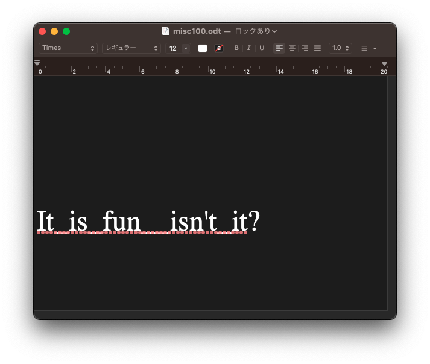

## 問題

> Find the flag in this zip file.
> file

## 解法

zipファイルをダウンロードして、`file`コマンドを実行すると、**OpenDocument Drawing**というファイルだとのこと。

```bash
$ file misc100.zip 
misc100.zip: OpenDocument Drawing
```

拡張子を`.zip`から`.odt`に変更すると、macのテキストエディットで開けるようになる。



出てきた文字列をフラグの形式に合わせて提出。